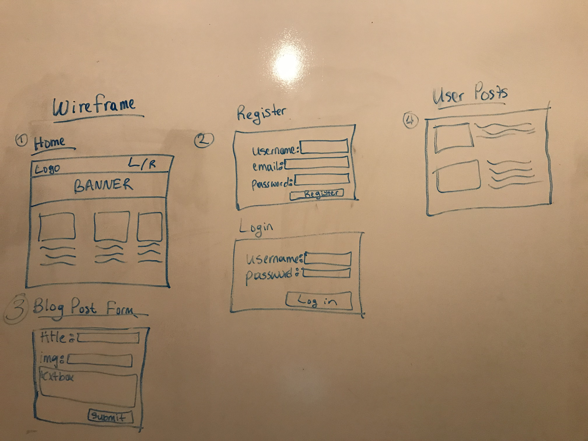
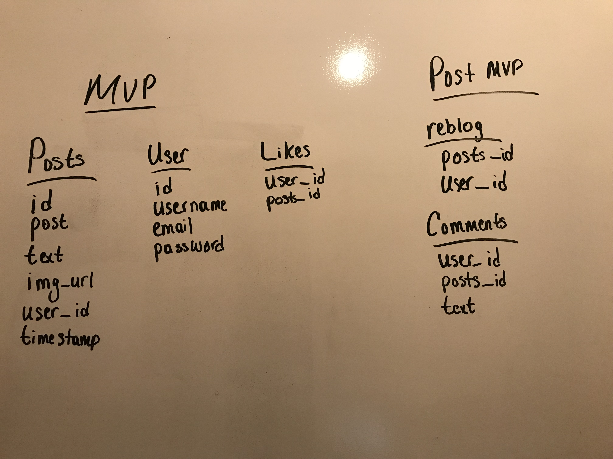

# Blogception

## Summary
Blogception is a blogging site where you can write about your latest hobbies, interests or just life.

## Getting Started
When you fork and clone it into your terminal. Follow these steps:
    - npm i in root application
    - Still in the root folder psql -f db/schema.sql to load up the database.
    - There is a seed.sql file also, but it is commented out. If you want to use the data uncomment and psql -f db/seed.sql
    - cd into client and do a yarn install
    - Once you installed all dependencies npm run dev to get both the client and server running.

## User Story
User will be on the landing page of the Blogception. They will be able to see post of users. The home page will have basic information about how to setup a blog along with a blog post.

There will be a login and register button. If they have not registered they will click on the register link and be guided to a register form. If otherwise they will be guided to a login form.

The user will be able to create, edit and delete a blog post. The read functionality will be for all non-logged in and logged in users.

### DAY 1 May 24th
Brainstorming about what I will be doing for my project 4. Came up with doing a blog application. Decided on the core technologies that I will be using. For the front-end I will be using React.js. This is be one of the biggest challenges for me since my React skills are low. As for the backend I will be doing Node.js and Express.js. I feel more comfortable with Express and since we only learned Rails for three days I do not want to spend most of my project time on Rails.

- WORKFLOW LIST
    - Setup React app and Express application (COMPLETED)
    - Setup server (COMPLETED)
    - create database (COMPLETED)
    - create tables (COMPLETED)
    - Have CRUD working on back-end (COMPLETED)

### DAY 2 May 25th
Today was also a slow day. Tried to do front-end crud and create a form but was too flustered. I instead I started on the back-end authorization. I was able to complete registering and logging in using Postman. I then tackled front-end again. I decided to go with the register and log in forms. I will get to the crud part after I complete those forms. I will check them once I'm done with the front-end crud.
- WORKFLOW LIST
    - Start on Authorization (Login/Register/Tokens) (COMPLETED)
    - Created some forms preferably the register form.

### DAY 3-5 May 26th - 28th
- WORKFLOW LIST
    - Continue working on authorization forms on front-end
    - Try to complete front-end CRUD
        - POST WORKFLOW
            - If I successfully tackled everything above I will tackle logic for logged in users to be the only ones to create, edit and delete blog posts.

## Technologies
- React
- Express
- Postgresql
- Models & Controllers
- Authorization

## MVP
- CRUD
- Auth
- Reblog
- Styling

## Post MVP
- Comments
- Likes

## Wireframe

## ERD

## Time Management
| Component | Priority | Estimated Time | Time Invetsted | Actual Time |
| --- | :---: |  :---: | :---: | :---: |
| Database | H | 5hrs | 6hrs | N/A |
| Models & Controller | H | 5hrs | 3hrs | N/A |
| CRUD functionality Back-end | H | 9hrs | 3hrs | N/A |
| CRUD functionality Front-end | H | 15hrs | N/A | N/A |
| Styling | H | 72hrs | N/A | N/A |
| Total |  | | N/A | N/A |

## Obstacles

